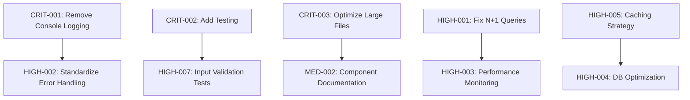

# Quality Improvement Task List
*Master-AI SaaS - Generated 2025-01-11*

## Task Priority Matrix

| Priority | Tasks | Est. Time | Impact | Risk Level |
|----------|-------|-----------|---------|------------|
| Critical | 3 | 16 hours | High | High |
| High | 8 | 32 hours | Medium-High | Medium |
| Medium | 12 | 28 hours | Medium | Low-Medium |
| Low | 10 | 20 hours | Low-Medium | Low |

---

## 🔴 CRITICAL PRIORITY (Fix Immediately)
*Must complete before next deployment*

### CRIT-001: Remove Production Console Logging
**Priority:** Critical | **Effort:** 6 hours | **Impact:** Security/Performance

**Issue:** 120+ console.log/warn/error statements in production code could expose sensitive data and impact performance.

**Subtasks:**
1. **Audit console statements** (1 hour)
   - Catalog all console.* calls in `/src` directory
   - Identify sensitive data exposure risks
   - Prioritize by data sensitivity

2. **Replace with proper logging** (4 hours)
   - Replace console.log with Winston logger calls
   - Update error logging to use monitoring system
   - Implement log levels (debug, info, warn, error)

3. **Add ESLint rule** (1 hour)
   - Configure no-console ESLint rule to prevent future occurrences
   - Add to pre-commit hooks

**Files affected:** All files in `/src` directory

**Success criteria:**
- [ ] Zero console.* statements in production builds
- [ ] All logging uses Winston/monitoring system
- [ ] ESLint prevents new console statements

---

### CRIT-002: Add Comprehensive Testing Coverage
**Priority:** Critical | **Effort:** 8 hours | **Impact:** Reliability/Deployment

**Issue:** Only 8 test files for 180+ source files. Insufficient for production deployment confidence.

**Subtasks:**
1. **API Route Testing** (4 hours)
   - Test all authentication endpoints
   - Test subscription/billing endpoints
   - Test dashboard API endpoints
   - Test error handling and edge cases

2. **Component Testing** (3 hours)
   - Test critical dashboard components
   - Test authentication forms
   - Test subscription components
   - Test error boundary components

3. **Integration Testing** (1 hour)
   - Test user authentication flow
   - Test lesson progress tracking
   - Test subscription upgrade flow

**Target Coverage:** >80% overall, >90% for critical paths

**Success criteria:**
- [ ] All API routes have test coverage
- [ ] Critical user journeys tested
- [ ] Pre-commit hooks run tests

---

### CRIT-003: Optimize Large Files (>300 lines)
**Priority:** Critical | **Effort:** 2 hours | **Impact:** Maintainability

**Issue:** 10 files exceed 300 lines, making them difficult to maintain and review.

**Subtasks:**
1. **Break down dashboard/achievements/page.tsx** (468 lines)
   - Extract achievement components
   - Create achievement hooks
   - Separate data fetching logic

2. **Break down auth/reset-password/page.tsx** (443 lines)
   - Extract password validation components
   - Create password reset hooks
   - Separate form validation logic

3. **Break down dashboard/page.tsx** (423 lines)
   - Extract dashboard sections
   - Create dashboard hooks
   - Separate data aggregation logic

**Files to optimize:**
- `src/app/dashboard/achievements/page.tsx` (468 lines)
- `src/app/auth/reset-password/page.tsx` (443 lines)
- `src/app/dashboard/page.tsx` (423 lines)
- `src/app/auth/welcome/page.tsx` (387 lines)

**Success criteria:**
- [ ] All files <300 lines
- [ ] Functionality preserved
- [ ] Components properly tested

---

## 🟡 HIGH PRIORITY (Next Sprint)
*Complete within 1-2 weeks*

### HIGH-001: Fix N+1 Query Patterns
**Priority:** High | **Effort:** 4 hours | **Impact:** Performance

**Issue:** 5 instances of `map(async)` patterns that could cause N+1 query problems under load.

**Subtasks:**
1. **Optimize background job processing** (2 hours)
   - Replace serial processing with batch operations
   - Implement proper transaction handling
   - Add performance logging

2. **Optimize achievement system queries** (1 hour)
   - Batch achievement progress calculations
   - Use single query for multiple users

3. **Optimize learning paths API** (1 hour)
   - Use include/select for eager loading
   - Reduce database round trips

**Files affected:**
- `src/lib/background-jobs.ts:175`
- `src/lib/achievement-system.ts:164`
- `src/app/api/learning-paths/route.ts:52`

**Success criteria:**
- [ ] All N+1 patterns eliminated
- [ ] Performance tests pass
- [ ] Database query count reduced

---

### HIGH-002: Standardize API Error Handling
**Priority:** High | **Effort:** 3 hours | **Impact:** Reliability

**Issue:** Inconsistent error handling patterns across API routes.

**Subtasks:**
1. **Create error handling middleware** (1 hour)
2. **Update all API routes to use middleware** (2 hours)
3. **Add error response testing** (1 hour)

**Success criteria:**
- [ ] Consistent error responses
- [ ] Proper HTTP status codes
- [ ] Error logging integrated

---

### HIGH-003: Implement Performance Monitoring
**Priority:** High | **Effort:** 4 hours | **Impact:** Performance/Operations

**Subtasks:**
1. **Add Web Vitals tracking** (2 hours)
2. **Implement API response time monitoring** (1 hour)
3. **Set up performance alerts** (1 hour)

---

### HIGH-004: Add Database Query Optimization
**Priority:** High | **Effort:** 3 hours | **Impact:** Performance

**Subtasks:**
1. **Analyze slow queries** (1 hour)
2. **Add missing indexes** (1 hour)
3. **Optimize complex joins** (1 hour)

---

### HIGH-005: Implement Caching Strategy
**Priority:** High | **Effort:** 4 hours | **Impact:** Performance

**Subtasks:**
1. **Cache lesson content** (2 hours)
2. **Cache user progress data** (1 hour)
3. **Cache learning path data** (1 hour)

---

### HIGH-006: Add API Rate Limiting
**Priority:** High | **Effort:** 2 hours | **Impact:** Security

**Subtasks:**
1. **Implement rate limiting middleware** (1 hour)
2. **Configure rate limits per endpoint** (1 hour)

---

### HIGH-007: Add Input Validation Tests
**Priority:** High | **Effort:** 3 hours | **Impact:** Security

**Subtasks:**
1. **Test XSS prevention** (1 hour)
2. **Test SQL injection prevention** (1 hour)  
3. **Test input sanitization** (1 hour)

---

### HIGH-008: Optimize Bundle Size
**Priority:** High | **Effort:** 5 hours | **Impact:** Performance

**Subtasks:**
1. **Analyze bundle composition** (1 hour)
2. **Implement code splitting** (3 hours)
3. **Optimize imports** (1 hour)

---

## 🟢 MEDIUM PRIORITY (Next Month)
*Complete within 2-4 weeks*

### MED-001: Reduce Code Duplication
**Priority:** Medium | **Effort:** 3 hours | **Impact:** Maintainability

**Subtasks:**
1. **Extract common API patterns** (1 hour)
2. **Create shared utility functions** (1 hour)
3. **Refactor similar components** (1 hour)

---

### MED-002: Add Component Documentation
**Priority:** Medium | **Effort:** 4 hours | **Impact:** Developer Experience

**Subtasks:**
1. **Document component props** (2 hours)
2. **Add usage examples** (1 hour)
3. **Create component catalog** (1 hour)

---

### MED-003: Implement Error Boundary Testing
**Priority:** Medium | **Effort:** 2 hours | **Impact:** Reliability

---

### MED-004: Add API Documentation
**Priority:** Medium | **Effort:** 3 hours | **Impact:** Developer Experience

---

### MED-005: Implement Graceful Degradation
**Priority:** Medium | **Effort:** 4 hours | **Impact:** User Experience

---

### MED-006: Add Loading State Optimization
**Priority:** Medium | **Effort:** 3 hours | **Impact:** User Experience

---

### MED-007: Implement Offline Support
**Priority:** Medium | **Effort:** 5 hours | **Impact:** User Experience

---

### MED-008: Add Progressive Enhancement
**Priority:** Medium | **Effort:** 2 hours | **Impact:** Accessibility

---

### MED-009: Optimize Mobile Performance
**Priority:** Medium | **Effort:** 3 hours | **Impact:** User Experience

---

### MED-010: Add Feature Flags
**Priority:** Medium | **Effort:** 3 hours | **Impact:** Deployment

---

### MED-011: Implement A/B Testing Framework
**Priority:** Medium | **Effort:** 4 hours | **Impact:** Product

---

### MED-012: Add Analytics Events
**Priority:** Medium | **Effort:** 2 hours | **Impact:** Product Insights

---

## 🔵 LOW PRIORITY (Future Iterations)
*Complete as time allows*

### LOW-001: Refactor Long Functions
**Priority:** Low | **Effort:** 3 hours | **Impact:** Maintainability

---

### LOW-002: Add Type Safety Improvements
**Priority:** Low | **Effort:** 2 hours | **Impact:** Developer Experience

---

### LOW-003: Implement Code Metrics Dashboard
**Priority:** Low | **Effort:** 4 hours | **Impact:** Operations

---

### LOW-004: Add Automated Dependency Updates
**Priority:** Low | **Effort:** 2 hours | **Impact:** Maintenance

---

### LOW-005: Implement Database Migration Testing
**Priority:** Low | **Effort:** 3 hours | **Impact:** Reliability

---

### LOW-006: Add Performance Regression Testing
**Priority:** Low | **Effort:** 3 hours | **Impact:** Performance

---

### LOW-007: Implement Accessibility Improvements
**Priority:** Low | **Effort:** 4 hours | **Impact:** Compliance

---

### LOW-008: Add Internationalization Support
**Priority:** Low | **Effort:** 6 hours | **Impact:** Global Reach

---

### LOW-009: Implement Advanced Monitoring
**Priority:** Low | **Effort:** 3 hours | **Impact:** Operations

---

### LOW-010: Add Code Quality Gates
**Priority:** Low | **Effort:** 2 hours | **Impact:** Quality Assurance

---

## Task Dependencies

## Sprint Planning Recommendations

### Sprint 1 (1 week): Critical Issues
- CRIT-001: Remove Console Logging
- CRIT-002: Add Testing Coverage  
- CRIT-003: Optimize Large Files

### Sprint 2 (1 week): Performance & Security
- HIGH-001: Fix N+1 Queries
- HIGH-002: Standardize Error Handling
- HIGH-006: Rate Limiting
- HIGH-007: Input Validation

### Sprint 3 (1 week): Performance Optimization
- HIGH-003: Performance Monitoring
- HIGH-004: Database Optimization
- HIGH-005: Caching Strategy
- HIGH-008: Bundle Optimization

### Sprint 4 (2 weeks): Polish & Documentation
- MED-001 through MED-006
- Selected LOW priority items

## Success Metrics

### Sprint 1 Targets
- [ ] Zero console statements in build
- [ ] >80% test coverage
- [ ] All files <300 lines

### Sprint 2 Targets  
- [ ] Zero N+1 query patterns
- [ ] Consistent error handling
- [ ] Rate limiting active

### Sprint 3 Targets
- [ ] <2s page load times
- [ ] <500ms API responses
- [ ] Performance monitoring active

### Overall Project Targets
- [ ] Health Score: 90+/100
- [ ] Zero critical security issues
- [ ] Production-ready quality gates